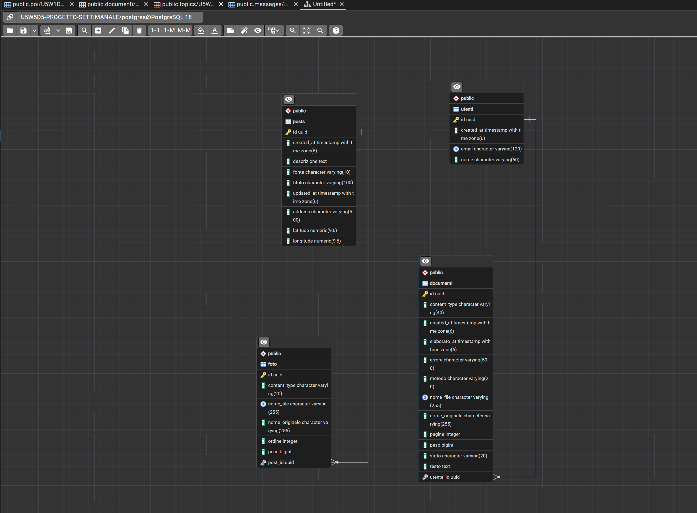

# Camera Oscura - U5W5D5 Progetto settimanale

Applicazione full stack (Spring Boot + React) per pubblicare post fotografici, geolocalizzarli
e archiviare documenti personali con estrazione automatica del testo (OCR).

Il nome e lo stile vengono dalla camera oscura fotografica: le foto si "sviluppano", i post sono
polaroid appese in bacheca, i documenti in elaborazione stanno "nella vasca di sviluppo".

-------------------

## Step 1 - Post con foto

### Prima pianificazione (appunti iniziali)

```
Post
ID - guuid
Titolo - varchar
Path - Stringa
Peso - long
created_At - Istant
Descrizione
```

### Modello finale

```
Post
ID - UUID
Titolo - varchar(100), obbligatorio
Descrizione - TEXT, facoltativa
Fonte - enum CAMERA / UPLOAD
created_At - Instant
updated_At - Instant
Posizione - GeoPoint (embedded, facoltativa)  -> step 2
Foto - lista 1-N, ordinata

Foto
ID - UUID
NomeFile - stringa (UUID + estensione, generato dal server)
NomeOriginale - stringa
ContentType - stringa
Peso - long
Ordine - int
Post - ManyToOne
```

### PostController

```
/api/posts

GET - Ritorna tutti i post (dal più recente)
Service (query con EntityGraph: carica post e foto in una sola query)

GET /{id} - Ritorna un post

POST - Crea un post (multipart: titolo, descrizione, fonte, foto 1..N,
       latitude/longitude/address facoltativi)
Service (valida TUTTI i file prima di scrivere qualsiasi cosa, salva i file su disco,
         salva Post + Foto nel DB. Se il DB fallisce anche al commit, cancella i file già scritti)

PATCH /{id} - Modifica titolo e/o descrizione (solo i campi presenti)
Service (controlla le modifiche: titolo non vuoto, lunghezze massime)

DELETE /{id} - Elimina il post
Service (cancella il record e, solo dopo il commit, anche i file dal disco)

PUT /{id}/posizione - Imposta la posizione  -> step 2
DELETE /{id}/posizione - Rimuove la posizione -> step 2
```

### Validazione dei file (stesse regole FE e BE)

```
1 file non vuoto
2 max 10MB per foto, max 5 foto, fotocamera = 1 foto
3 estensione: jpg, jpeg, png
4 MIME dichiarato coerente con l'estensione (image/jpeg, image/png)
5 magic bytes: il contenuto reale deve essere quello dichiarato
  JPEG -> FF D8 FF
  PNG  -> 89 50 4E 47 0D 0A 1A 0A
```

Perché i magic bytes: estensione e `Content-Type` li decide il client, basta rinominare un file per
falsificarli. I primi byte del file invece dicono cosa c'è davvero dentro.
Il frontend fa gli stessi controlli (legge i primi byte con `file.slice().arrayBuffer()`) per dare
subito l'errore all'utente, ma il backend ricontrolla sempre: l'attributo `accept` dell'input è
solo un filtro grafico.

### Fotocamera

- `getUserMedia` + `<canvas>`: anteprima live nel browser, lo scatto diventa un `File` JPEG.
  Funziona anche da desktop con webcam (l'alternativa `<input capture>` apre la fotocamera solo su mobile).
- Stream spento quando il componente viene smontato.
- Errori gestiti: permesso negato, nessuna fotocamera, fotocamera già in uso.

-------------------

## Step 2 - Geolocalizzazione

La posizione appartiene al **post**, non alle singole foto.

```
GeoPoint (@Embeddable dentro Post)
latitude (precision = 9, scale = 6)
private BigDecimal latitude
longitude (precision = 9, scale = 6)
private BigDecimal longitude
address - varchar(500), facoltativo

protected GeoPoint(){}

geocoding: base-url: ${GEOCODING_BASE_URL:https://geocode.googleapis.com}
```

Decisioni:
- `@Embeddable` e non entità separata: è 1-1 con il post, niente tabella in più. Colonne tutte
  null = post senza posizione.
- `regionCode` e `languageCode` **non** stanno nell'entità: sono parametri delle richieste a Google
  (paese di preferenza, lingua dell'indirizzo), quindi vanno in configurazione (`IT`, `it`).
- 6 decimali = circa 11 cm di precisione. Google restituisce ~15 decimali: non li rifiuto,
  li arrotondo (`setScale(6, HALF_UP)`). Valido solo i range (lat -90..90, lng -180..180).
- Latitudine e longitudine insieme o nessuna; l'indirizzo solo se ci sono le coordinate.
- Il salvataggio del post **non** chiama Google: se Google non risponde, il post si pubblica lo stesso.
  Il geocoding serve solo come aiuto mentre scelgo il punto.

### GeocodingController (proxy verso Google)

```
/api/geocoding

GET /search?indirizzo= - Da indirizzo a coordinate (max 5 risultati, lista vuota se nessuno)
GET /reverse?lat=&lng= - Da coordinate a indirizzo (404 se nessun indirizzo)
Service (Geocoding API v4 con RestClient: header X-Goog-Api-Key, field mask,
         timeout 3s/5s. Errori Google -> 502, chiave mancante -> 503)
```

Perché un proxy: la chiave del Geocoding resta sul server, il browser chiama solo il mio backend.

### Frontend

- Mappa Google Maps JS (`@vis.gl/react-google-maps`), tema scuro, segnaposto rosso "luce di sicurezza".
- Scelta del punto: click o trascinamento sulla mappa, ricerca indirizzo, "Usa la mia posizione"
  (`navigator.geolocation`).
- EXIF: se una foto caricata contiene coordinate GPS (libreria `exifr`), propone di usarle.
  Lo scatto da browser invece non ha EXIF, quindi per la fotocamera suggerisco la geolocalizzazione.
- Mini-mappa nella card caricata solo su richiesta: ogni mappa è un "map load" a pagamento.
- Vista "Mappa" con tutti i post geolocalizzati.

-------------------

## Step 3 - Profilo e documenti con OCR

I documenti caricati sul proprio profilo vengono elaborati con OCR per estrarne il testo.

```
Utente
ID - UUID
Nome - varchar(60)
Email - varchar(120), unica
created_At - Instant
Documenti - lista 1-N (cascade: eliminando il profilo si eliminano i documenti)

Documento
ID - UUID
Utente - ManyToOne
NomeFile - stringa (UUID + estensione)
NomeOriginale - stringa
ContentType - stringa
Peso - long
Stato - enum IN_ATTESA / IN_ELABORAZIONE / DA_REVISIONARE / COMPLETATO / ERRORE
Metodo - enum TESTO_PDF / OCR / MISTO
Pagine - int
Testo - TEXT (testo corrente, eventualmente corretto a mano)
TestoOcr - TEXT (testo originale letto da PDF/OCR, per il ripristino)
Errore - varchar(500)
created_At - Instant
elaborato_At - Instant
modificato_At - Instant (ultima correzione manuale, null = testo uguale all'OCR)
```

### UtenteController

```
/api/utenti

GET - Tutti i profili (con numero di documenti)
GET /{id} - Un profilo
POST - Crea profilo (email unica -> 409 se già usata)
DELETE /{id} - Elimina profilo, documenti e file
```

### DocumentoController

```
GET /api/utenti/{utenteId}/documenti?q= - Documenti del profilo, ricerca nel nome e nel testo estratto
POST /api/utenti/{utenteId}/documenti - Upload (multipart "file", max 5) -> 202 Accepted
Service (valida, salva su disco nella cartella privata, salva IN_ATTESA, pubblica l'evento per l'OCR)

GET /api/documenti/{id} - Dettaglio con testo completo
GET /api/documenti/{id}/file - File originale (inline)
PUT /api/documenti/{id}/testo - Modifica il testo ({testo, conferma})
Service (possibile in DA_REVISIONARE e COMPLETATO, 409 durante l'OCR.
         conferma=true -> salva nell'archivio: DA_REVISIONARE -> COMPLETATO)
POST /api/documenti/{id}/ripristina - Torna al testo originale dell'OCR
POST /api/documenti/{id}/ocr - Rielabora (409 se già in elaborazione)
Service (aggiorna sempre TestoOcr; il testo corrente solo se non è stato corretto a mano)
DELETE /api/documenti/{id} - Elimina documento e file
```

### Flusso OCR

```
upload -> 202, stato IN_ATTESA
       -> evento DocumentoDaElaborare, parte solo DOPO il commit (TransactionalEventListener)
       -> thread del pool "ocr-" (2 thread, Tesseract usa molta CPU)
       -> IN_ELABORAZIONE
       -> PDF: per ogni pagina provo il testo nativo con PDFBox
               se la pagina ha almeno 20 caratteri -> uso quello (niente OCR)
               altrimenti è una scansione -> render a 300 DPI -> Tesseract
          Immagini / TIFF (anche multipagina) -> Tesseract
       -> DA_REVISIONARE (testo + metodo + pagine) oppure ERRORE (messaggio)
       -> l'utente controlla e corregge il testo nell'editor
          "Salva bozza" -> resta DA_REVISIONARE
          "Salva nell'archivio" -> COMPLETATO
       -> anche dopo il salvataggio il testo resta modificabile; "Ripristina OCR" torna all'originale
frontend: polling ogni 2s finché ci sono documenti in coda
all'avvio: i documenti rimasti IN_ATTESA / IN_ELABORAZIONE vengono rimessi in coda
```

Perché asincrono: l'OCR impiega secondi per pagina, la richiesta HTTP non deve restare appesa.
Perché dopo il commit: altrimenti il thread OCR potrebbe cercare un documento non ancora salvato.
Perché update mirati sul DB dal thread OCR: se nel frattempo il documento viene eliminato,
l'aggiornamento non lo ricrea per sbaglio.

### Formati documenti (stesse regole FE e BE)

```
PDF  -> %PDF-
JPEG -> FF D8 FF
PNG  -> 89 50 4E 47 0D 0A 1A 0A
TIFF -> 49 49 2A 00 (little endian) oppure 4D 4D 00 2A (big endian)
max 20MB per documento, max 5 per caricamento
```

I documenti stanno in una cartella **privata** (`BE/documenti`), non servita come file statici
come le foto: si scaricano solo passando da `/api/documenti/{id}/file`.

### Tesseract

- Tess4J (wrapper Java di Tesseract) + PDFBox per i PDF.
- Tesseract installato ha solo `eng`: per l'italiano uso una cartella `BE/tessdata` nel progetto
  con `eng` + `ita` (niente permessi admin su Program Files). OCR in `ita+eng`.
- Java 25 + JNA: serve `--enable-native-access=ALL-UNNAMED` (già configurato nel `pom.xml`).

-------------------

## Schema del database

Diagramma ER generato con pgAdmin sul database PostgreSQL (tabelle create da Hibernate con `ddl-auto=update`).



```
posts   1 --- N  foto        (foto.post_id)
utenti  1 --- N  documenti   (documenti.utente_id)
```

- `posts` contiene anche `latitude`, `longitude`, `address`: sono le colonne del `GeoPoint` embedded,
  niente tabella separata per la posizione.
- `foto.nome_file` e `documenti.nome_file` sono unici (icona "1"): il nome generato su disco non si ripete.
- `utenti.email` è unica: un solo profilo per indirizzo email.
- Enum salvati come stringa (`fonte`, `stato`, `metodo`): leggibili nel DB e sicuri se cambia l'ordine dei valori.

-------------------

## Struttura

```
BE/                         Spring Boot 4.1.1, Java 25, PostgreSQL
  entities/                 Post, Foto, GeoPoint, Utente, Documento + enum
  repositories/
  dto/                      request/response come record
  services/                 PostService, ImageValidator, GeocodingService,
                            DocumentoService, DocumentoValidator, OcrService,
                            ElaborazioneDocumenti (OCR in background), FileStorageService
  controllers/
  exceptions/               GlobalExceptionHandler: errori JSON {messaggio, dettagli, timestamp}
  config/                   CORS, cartelle upload/documenti, RestClient Google, pool OCR
FEJSX/                      React 19 + Vite
  src/api/                  client fetch condiviso, postsApi, profiloApi
  src/utils/                validazione foto/documenti, posizione ed EXIF
  src/components/           form post, fotocamera, polaroid, lightbox
  src/components/mappa/     picker posizione, mini-mappa, mappa dei post
  src/components/profilo/   profili, archivio documenti, visualizzatore testo
docs/                       schema del database (immagine del README)
avvia.cmd                   avvia BE e FE in due finestre
```

-------------------

## Come avviarlo

Requisiti: Java 25, Node.js, PostgreSQL, API key Google con **Geocoding API** e **Maps JavaScript API**.

1. Crea il database su PostgreSQL.
2. `BE/env.properties` (copia di `env.properties.example`, non committato):
   ```
   DB_NAME=...
   DB_USER=...
   DB_PASSWORD=...
   GOOGLE_API_KEY=...
   ```
3. `FEJSX/.env.local` (copia di `.env.example`, non committato):
   ```
   VITE_API_URL=http://localhost:8080
   VITE_GOOGLE_MAPS_API_KEY=...
   VITE_GOOGLE_MAPS_MAP_ID=DEMO_MAP_ID
   ```
4. Modelli Tesseract in `BE/tessdata` (cartella non committata):
   - `eng.traineddata` da `C:\Program Files\Tesseract-OCR\tessdata`
   - `ita.traineddata` da https://github.com/tesseract-ocr/tessdata_fast
5. Doppio click su `avvia.cmd` (oppure `cd BE; .\mvnw.cmd spring-boot:run` e `cd FEJSX; npm run dev`).
   Si apre http://localhost:5173.

Test:
```
cd BE; .\mvnw.cmd test      # validazione file, geocoding (mock), GeoPoint, OCR reale con Tesseract
cd FEJSX; npm run lint
```
